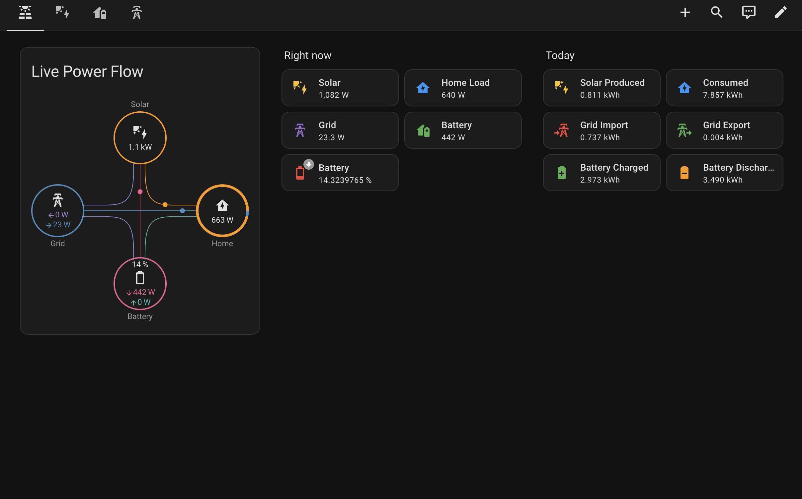
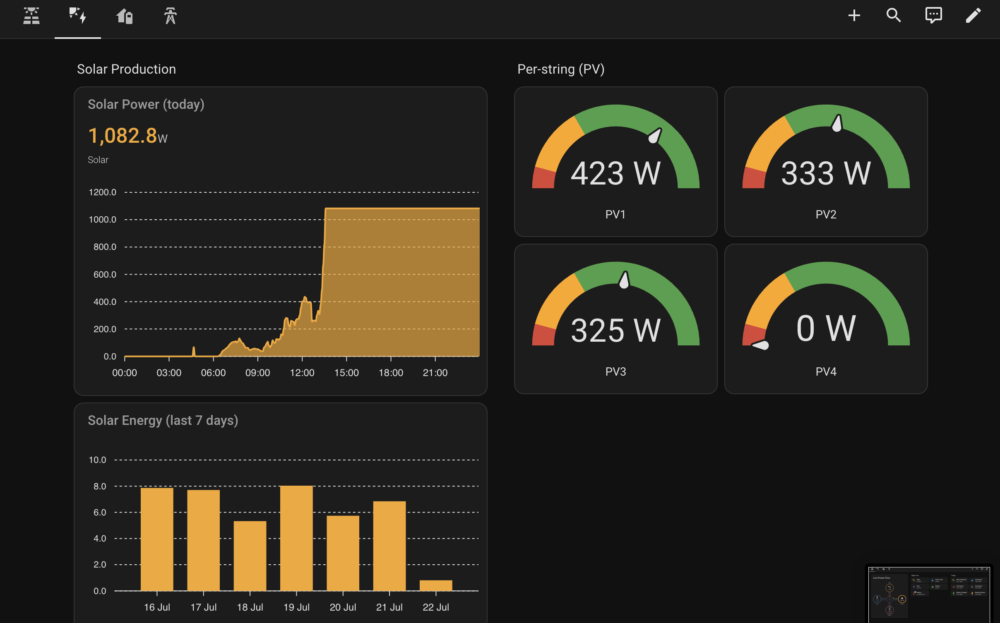
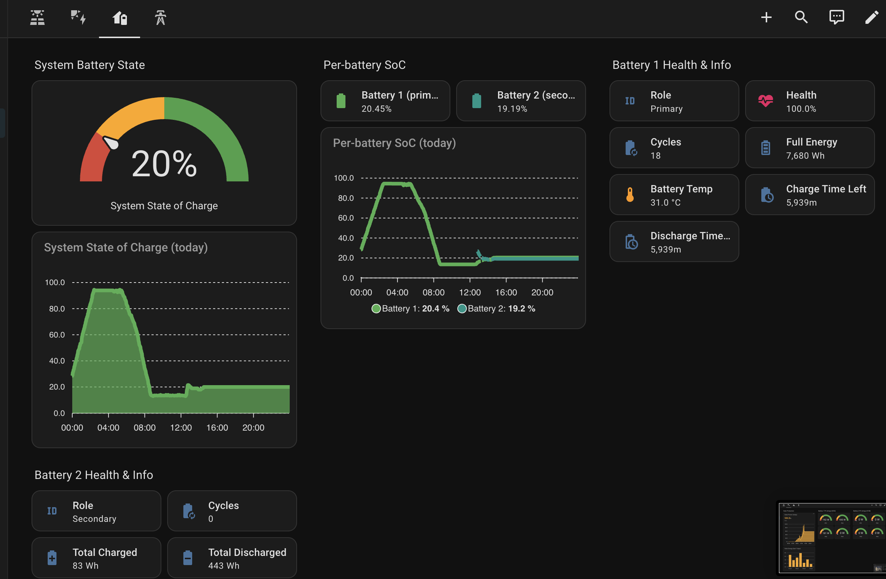
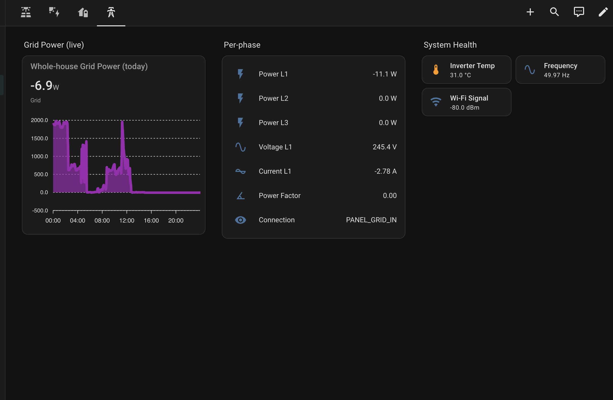

# EcoFlow Stream (Public API) — Home Assistant Integration

A lightweight, independent Home Assistant integration for the **EcoFlow Stream Ultra X**
inverter and the EcoFlow **Smart Meter**, built on EcoFlow's
**official public developer API** (IoT Open) — HMAC-signed HTTP plus the EcoFlow MQTT
broker for near-real-time push telemetry.

> **Supported devices:** this integration has only been developed and verified against
> the **Stream Ultra X** inverter and the **Smart Meter**. Other Stream models
> (Stream, Stream Max, Stream Ultra) are **not officially supported** — see
> [Supported devices](#supported-devices) below.

> This is a clean-room integration that uses only EcoFlow's documented public API.
> It is **not** derived from any other integration's code. It was inspired by the
> excellent [tolwi/hassio-ecoflow-cloud](https://github.com/tolwi/hassio-ecoflow-cloud)
> project, which takes a different (private-API / protobuf) approach.

## Features

- **Near-real-time power flow** via MQTT push — solar, battery, grid, and home load.
- **Per-string PV power** (PV1–PV4) for the Stream Ultra X inverter.
- **Battery detail** — state of charge, health, cycles, temperature, time-to-full/empty.
- **Daily energy sensors** (`*_today`) for solar, consumption, grid import/export, and
  battery charge/discharge — ready to drop into the Home Assistant **Energy Dashboard**.
- **Smart Meter support** — whole-house grid power (per phase), plus derived daily
  grid import/export energy sensors (integrated from live power, reset at local midnight).
- **Multi-device** — every entity is scoped by serial number, so multiple Stream units
  coexist without collision.
- **Device selection** — choose exactly which of your account's devices to set up, and
  add or remove them any time from the **Configure** screen.

## Requirements

- Home Assistant 2024.1.0 or newer.
- An EcoFlow **Developer** account with an **Access Key** and **Secret Key**
  (create these at <https://developer.ecoflow.com/>).
- One or more supported devices registered to that account.

## Supported devices

This integration is developed and tested **only** against:

| Device | Live power sensors | Daily energy (`*_today`) sensors |
| --- | :---: | :---: |
| **Stream Ultra X** (inverter) | ✅ verified | ✅ verified |
| **Smart Meter** | ✅ verified | ✅ (derived from live power) |

**Other Stream models (Stream, Stream Max, Stream Ultra) are not officially
supported.** They will still be *discovered* and set up without errors, but:

- Live power sensors may or may not populate, depending on whether the model
  publishes the same MQTT field names as the Ultra X (unverified).
- The **daily energy sensors will not work** — the historical-energy API codes are
  specific to the Stream Ultra X (`BK621`), so those sensors are skipped on other
  models.

Nothing should crash on an unsupported model — it simply degrades: unsupported sensors
stay unavailable or are not created. If you have another Stream model and want to
help add support, please open an issue with a diagnostic dump.

## Installation

### HACS (custom repository)

1. In HACS → **Integrations** → three-dot menu → **Custom repositories**.
2. Add this repository URL, category **Integration**.
3. Install **EcoFlow Stream (Public API)** and restart Home Assistant.

### Manual

Copy `custom_components/ecoflow_streamx` into your Home Assistant
`config/custom_components/` directory and restart.

## Configuration

1. **Settings → Devices & Services → Add Integration → EcoFlow Stream (Public API)**.
2. Enter your **Access Key**, **Secret Key**, a **Group** name (any label, e.g. `Home`),
   and pick your **region host**:
   - **EU:** `api-e.ecoflow.com`
   - **US / Global:** `api.ecoflow.com`
3. The integration validates your credentials and lists the devices found on your
   account. **Tick the devices you want to set up** and submit — entities are created
   for each selected device.

### Adding or removing devices later

Your device selection is saved with the integration and is authoritative, so a unit
you did not select (for example, one you have removed from your EcoFlow account but
that the API still reports) will **not** be set up and cannot flood the logs with
reconnect attempts.

To change the selection, go to **Settings → Devices & Services → EcoFlow Stream →
Configure**. That screen re-scans your account so newly added hardware appears; tick
the devices you want and submit — the integration reloads automatically.

## Energy Dashboard

The `*_today` energy sensors use `state_class: total_increasing` and reset at local
midnight, so they map cleanly onto the Energy Dashboard:

| Energy Dashboard slot | Sensor |
| --- | --- |
| Solar production | `sensor.<stream>_solar_energy_today` |
| Grid consumption | `sensor.<meter>_grid_import_energy` |
| Return to grid | `sensor.<meter>_grid_export_energy` |
| Battery in | `sensor.<stream>_battery_charge_today` |
| Battery out | `sensor.<stream>_battery_discharge_today` |

## Dashboard

A ready-made Lovelace dashboard is included at
[`dashboards/solar_dashboard.yaml`](dashboards/solar_dashboard.yaml). It uses the
following HACS frontend cards:

- Power Flow Card Plus (`custom:power-flow-card-plus`)
- ApexCharts Card (`custom:apexcharts-card`)
- Mushroom (`custom:mushroom-*`)

Copy its contents into a new dashboard via **Edit → Raw configuration editor**, then
adjust the entity IDs to match your device serial numbers.

### Overview

Live power flow between solar, battery, grid, and home, plus "right now" and "today"
summary tiles.

### Solar

Solar power today, per-string (PV1–PV4) output gauges, and a 7-day energy history.

### Battery

State of charge, health, cycles, temperature, full-energy capacity, and
charge/discharge time estimates.

### Grid

Whole-house grid power, per-phase power/voltage/current, and system health
(inverter temperature, frequency, Wi-Fi signal).

## Entity reference

For a full breakdown of every sensor the integration creates — including the exact
MQTT field or REST endpoint each one is sourced from, its unit, and any value
transform applied — see [`docs/entity_mapping.md`](docs/entity_mapping.md).

## Notes & caveats

- **First data can take a while — entities may show "unavailable" at first.**
  Telemetry arrives over EcoFlow's MQTT broker as *incremental* push messages, and
  the integration only reports a value once its field has been seen at least once.
  After adding the integration (or restarting Home Assistant) it is normal for many
  sensors to sit as **unavailable** for a period while the device pushes its first
  full set of readings — some slow-changing fields (battery health, cell voltages,
  cycle count) may only be reported every ~20–60 seconds, and occasionally longer if
  the device is idle. Give it a few minutes to populate before assuming something is
  wrong. Sensors also briefly ride through short MQTT reconnects, only dropping to
  "unavailable" after a genuine outage (no telemetry for ~5 minutes).
- **Grid sign convention:** the Smart Meter's derived import/export energy depends on
  the sign of `powGetSysGrid`. If import/export appear swapped, flip `IMPORT_IS_POSITIVE`
  in `custom_components/ecoflow_streamx/meter_energy.py`.
- The Smart Meter's public API only exposes instantaneous power, so daily import/export
  kWh are integrated locally (trapezoidal) rather than read from a native counter.
- Historical energy aggregates are polled every 5 minutes to respect API rate limits.

## Rate limiting

The EcoFlow Public (IoT Open) API enforces limits on how often you may call its
endpoints and how many MQTT client IDs you may register. This integration is
designed to stay well inside them:

- **Push, not poll, for live data.** Real-time telemetry comes over a single
  persistent MQTT subscription per device — the integration does **not** poll for
  power/battery values. That is by far the largest source of requests in
  poll-based integrations, and it is eliminated here.
- **A fixed MQTT client ID.** The client ID is derived from your account and group
  (`ecoflow-streamx-{account}-{group}`) and reused on every (re)connect, so
  reconnects do not burn through EcoFlow's daily new-client-ID allowance.
- **Reconnect backoff.** If the broker drops a device, the MQTT client reconnects
  with exponential backoff (2 s → 300 s) instead of hammering the server, and the
  disconnect is logged once rather than on every retry. This avoids the retry
  storms that can get an account temporarily blacklisted.
- **Infrequent, staggered REST polls.** The only periodic HTTP calls are the daily
  energy aggregates, polled every **5 minutes** (`ENERGY_POLL_INTERVAL_SEC`) and
  **only** for devices that expose them (the Smart Meter is skipped entirely). The
  handful of requests in each poll are issued **sequentially with a ~1 s gap**
  (`ENERGY_REQUEST_STAGGER_SEC`) rather than all at once, keeping you under the
  per-second burst limit.
- **A light startup burst.** At setup/restart the integration makes a small,
  one-off set of requests (credentials, device list, one live snapshot per device,
  and a first energy poll for non-meter devices), then settles into the steady
  state above.

If EcoFlow ever tightens its limits, the two knobs to adjust are
`ENERGY_POLL_INTERVAL_SEC` (poll less often) and `ENERGY_REQUEST_STAGGER_SEC`
(space the requests further apart) in
`custom_components/ecoflow_streamx/const.py`.

## License

Released under the [MIT License](LICENSE). This project contains only original code and
does not redistribute any third-party integration source.
